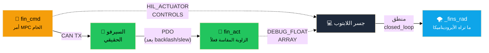
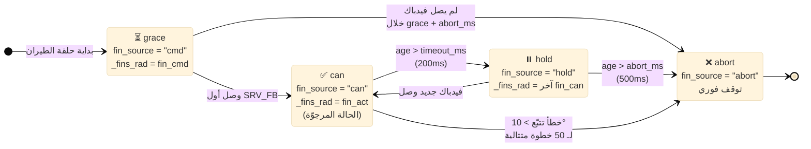
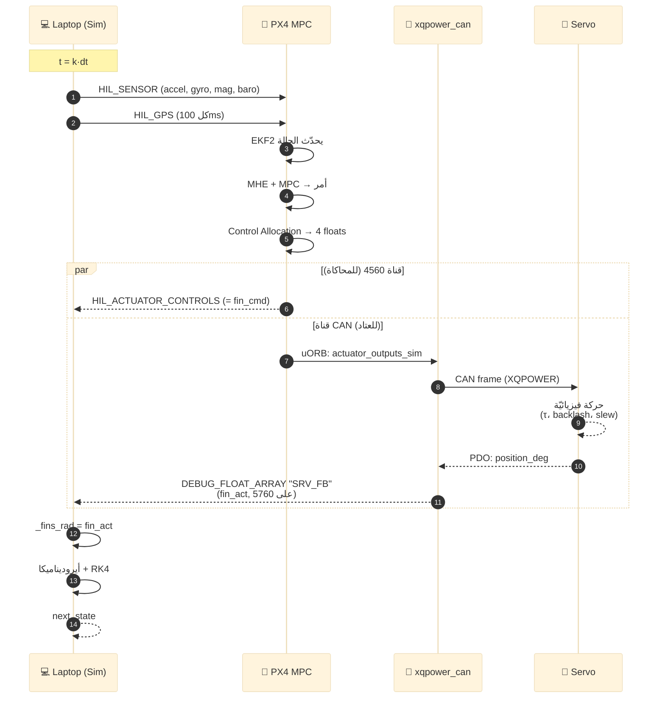
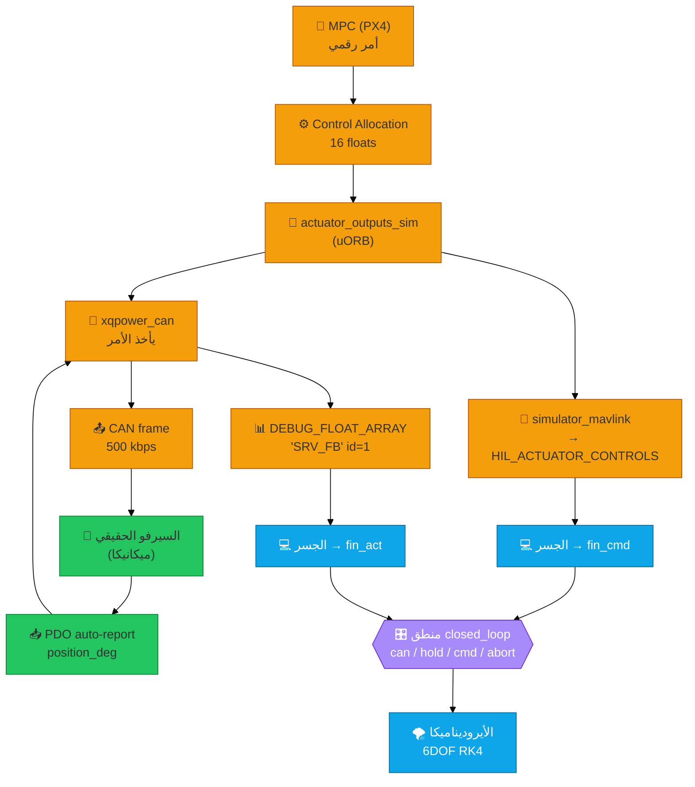
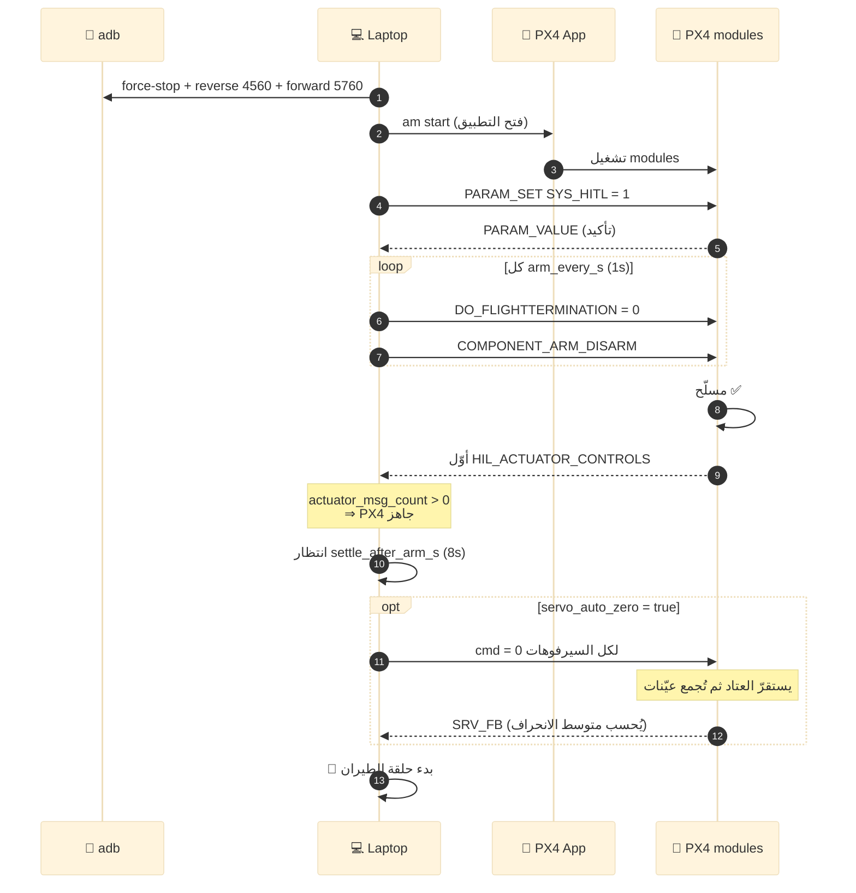
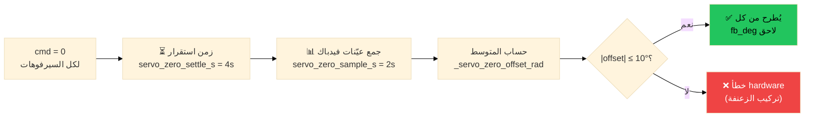
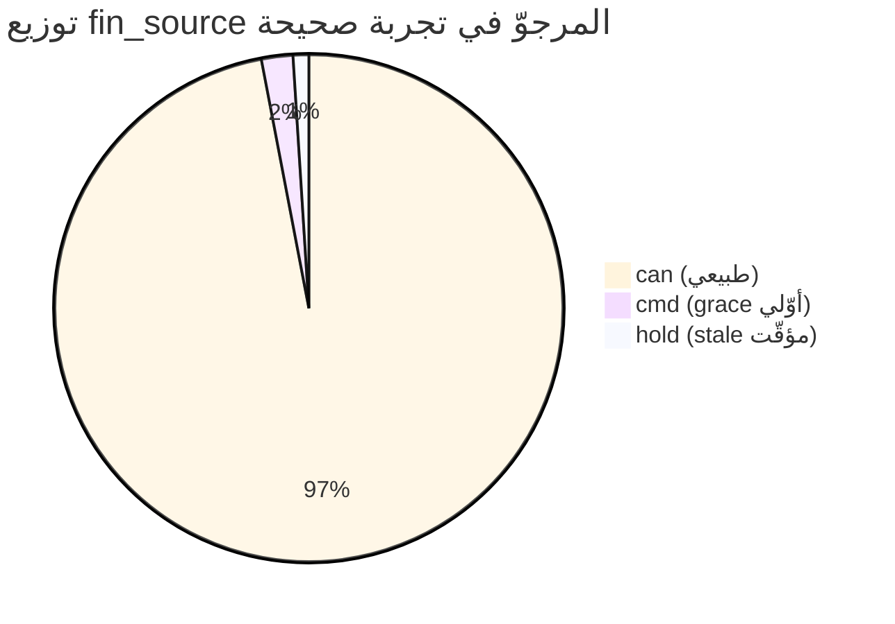

# M13 · HIL — ما الذي من المحاكاة وما الذي من PX4؟


> **مرجع الكود:** `6DOF_v4_pure/hil/{mavlink_bridge_hil.py, hil_config.yaml, README.md}`
> **الوضع المعتمد:** `mode: closed_loop` فقط.
> **التركيز:** الدفات (Control Surfaces) — من أين تأتي كل زاوية، ومن يتحكّم بها.

---

## 1. خريطة المسؤوليات — من يملك ماذا؟


ثلاث طبقات مستقلّة، كل طبقة مسؤولة عن جزء مختلف تماماً:


```mermaid
%%{init: {'theme':'base','themeVariables':{'primaryColor':'#1e3a8a','primaryTextColor':'#fff','lineColor':'#64748b','fontSize':'14px'}}}%%
graph TB
  subgraph LAPTOP["💻 اللابتوب · Python  (المحاكاة)"]
    direction TB
    PHYS["🌍 فيزياء + أيروديناميكا<br/>RK4 6DOF"]
    SENS["📡 حسّاسات اصطناعيّة<br/>IMU · Baro · Mag · GPS"]
    PICK["🎛️ اختيار زاوية الدفّة<br/>(can / hold / cmd / abort)"]
    SAFE["🛡️ طبقة السلامة<br/>grace · timeout · abort"]
  end

  subgraph PHONE["📱 الهاتف · PX4 C++  (الطيّار الآلي الحقيقي)"]
    direction TB
    EKF["🧭 EKF2<br/>تقدير الحالة"]
    MPC["🎯 MHE + MPC<br/>حلقة التحكم"]
    ALLOC["⚙️ Control Allocation"]
    CAN["📤 XqpowerCan driver<br/>CAN TX + PDO RX"]
  end

  subgraph HW["🔧 العتاد المادّي  (مستقلّ عن الاثنين)"]
    direction TB
    SERVOS["🛞 4× XQPOWER servos<br/>backlash · slew · latency<br/>PDO auto-report ~20Hz"]
  end

  PHYS --> SENS
  SENS -.HIL_SENSOR/GPS/STATE.-> EKF
  EKF --> MPC --> ALLOC
  ALLOC -.HIL_ACTUATOR_CONTROLS.-> PICK
  ALLOC --> CAN
  CAN -.CAN 500kbps.-> SERVOS
  SERVOS -.PDO.-> CAN
  CAN -.DEBUG_FLOAT_ARRAY "SRV_FB".-> PICK
  PICK --> PHYS
  SAFE --> PICK

  classDef sim fill:#0ea5e9,stroke:#0369a1,color:#fff
  classDef px4 fill:#f59e0b,stroke:#b45309,color:#000
  classDef hw  fill:#22c55e,stroke:#15803d,color:#000
  class PHYS,SENS,PICK,SAFE sim
  class EKF,MPC,ALLOC,CAN px4
  class SERVOS hw
```

---

## 2. قنوات الاتصال — ثلاث قنوات فيزيائيّة

```mermaid
%%{init: {'theme':'base'}}%%
flowchart LR
  LAP["💻 Laptop"]
  PX4["📱 PX4"]
  SRV["🛞 Servos"]

  LAP  ==TCP 4560<br/>HIL_SENSOR 100Hz<br/>HIL_GPS 10Hz<br/>HIL_STATE 50Hz==> PX4
  PX4  ==TCP 4560<br/>HIL_ACTUATOR_CONTROLS==> LAP
  PX4  ==TCP 5760<br/>DEBUG_FLOAT_ARRAY SRV_FB<br/>DEBUG_VECT TIMING==> LAP
  PX4  ==CAN 500kbps<br/>XQPOWER protocol==> SRV
  SRV  ==CAN PDO<br/>~20Hz/servo==> PX4

  style LAP fill:#0ea5e9,color:#fff
  style PX4 fill:#f59e0b
  style SRV fill:#22c55e
```

| القناة | البروتوكول | adb | الاتجاه | الحمولة |
|:------:|:---:|:---:|:---:|:---|
| **4560** | TCP / MAVLink v2 | `adb reverse tcp:4560 tcp:4560` | laptop ↔ PX4 | حسّاسات + أوامر الدفات |
| **5760** | TCP / MAVLink v2 (GCS) | `adb forward tcp:5760 tcp:5760` | PX4 → laptop | SRV_FB + TIMING |
| **CAN** | 500 kbps، بروتوكول XQPOWER | — | PX4 ↔ servos | أوامر + فيدباك ميكانيكي |

---

## 3. الزوايا الثلاث للدفّة — لا تخلط بينها


في كل خطوة، كل دفّة لها **ثلاث قيم مختلفة** — هذه هي النقطة الأهم في المستند:




| الاسم في الكود | CSV | المصدر | يُستخدم لـ |
|:---|:---:|:---:|:---|
| `_last_controls[:4]` | `fin_cmd_*` | 🟧 PX4 MPC | **تقييم** تتبّع السيرفو فقط (MAE / p95) |
| `_servo_fb_rad` = `_fin_can_rad` | `fin_act_*` / `fin_can_*` | 🟩 السيرفو الحقيقي | **دخل** الأيروديناميكا في الحالة الطبيعيّة |
| `_fins_rad` | (مُشتقّ) | 🟦 منطق الجسر | فعلياً يُمرَّر لـ `sim._integrate_one_step(...)` |


> **قرار جوهري** في `mavlink_bridge_hil.py:523` →
> ```python
> sim_cfg["simulation"]["use_actuator_dynamics"] = False
> ```
> لا توجد ديناميكا سيرفو برمجيّة. كل τ / slew / backlash / latency ترى الأيروديناميكا يأتي **حصراً** من العتاد المادّي. هذا هو جوهر الـ HIL.


---

## 4. آلة الحالة — من أين تأتي زاوية الدفّة في هذه الخطوة؟



### 4.1 المعادلات الزمنية (إعدادات `hil_config.yaml`)

```text
t=0 ├──────────── grace (500 ms) ────────────┤
    │                                         │
    │  _fins_rad = fin_cmd (مؤقّتاً)          │
    │                                         │
    ├── CAN ──┬──── timeout (200ms) ──┬─ abort (500ms) ──┤
    │ (كل     │  نحتفظ بآخر قيمة       │    ABORT فوري    │
    │ 50ms)   │        (HOLD)          │                  │
    │         │                        │                  │
t  ───────────────────────────────────────────────────▶
         age = now - last_SRV_FB
```

- `servo_feedback_timeout_ms = 200` → قياس CAN «قديم» بعد 200ms.
- `servo_feedback_abort_ms = 500` → تجاوزها ⇒ ABORT.
- `servo_feedback_grace_ms = 500` → فترة السماح قبل أول فيدباك.

---

## 5. تسلسل خطوة تحكّم واحدة  (10 ms)



> **ملاحظة:** قناتا `4560` و `CAN` متوازيتان — `fin_cmd` يصل للابتوب **بنفس اللحظة** التي يُرسَل فيها الأمر للعتاد. لكن `fin_act` يتأخّر لأن السيرفو ماديّ.

---

## 6. معدّلات الإرسال — كم رسالة بالثانية؟

```mermaid
%%{init: {'theme':'base'}}%%
gantt
  title معدّلات الإرسال في ثانية واحدة (dt=10ms)
  dateFormat X
  axisFormat %L

  section Laptop → PX4 (4560)
  HIL_SENSOR 100Hz       :done, 0, 1000
  HIL_STATE_QUAT 50Hz    :active, 0, 1000
  HIL_GPS 10Hz           :0, 1000
  HEARTBEAT 1Hz          :crit, 0, 1000

  section PX4 → Laptop (4560)
  HIL_ACTUATOR_CONTROLS  :done, 0, 1000

  section PX4 → Laptop (5760)
  SRV_FB ≤100Hz          :done, 0, 1000
  TIMING ~10Hz           :active, 0, 1000

  section CAN ↔ Servos
  CAN TX 100Hz           :done, 0, 1000
  PDO RX ~20Hz/servo     :active, 0, 1000
```



| الرسالة | التردّد | الاتجاه | الغاية |
|:---|:---:|:---:|:---|
| `HIL_SENSOR` | **100 Hz** | L → P | تغذّي EKF2 (IMU + baro + mag) |
| `HIL_GPS` | 10 Hz | L → P | تغذّي EKF2 (موقع/سرعة) |
| `HIL_STATE_QUATERNION` | 50 Hz | L → P | ground truth فقط (لا EKF) |
| `HEARTBEAT` | 1 Hz | L → P | حياة الوصلة |
| `HIL_ACTUATOR_CONTROLS` | كل خطوة MPC | P → L | **fin_cmd** |
| `DEBUG_FLOAT_ARRAY "SRV_FB"` | ≤ 100 Hz | P → L | **fin_act** من CAN |
| `DEBUG_VECT "TIMING"` | ~10 Hz | P → L | MHE/MPC/Cycle stats |
| CAN TX | 100 Hz | P → S | أوامر MPC مباشرة |
| CAN PDO | ~20 Hz لكل سيرفو | S → P | زاوية فيزيائيّة مقاسة |

---

## 7. تدفّق إشارة الدفّة — من MPC إلى الأيروديناميكا




### لماذا `fin_act` وليس `fin_cmd`؟


```text
 fin_cmd  (‫من MPC‬)  ────────────────────▶  (لا تدخل الأيروديناميكا)
     │
     │ ~10 ms tx + τ سيرفو + backlash
     ▼
 fin_act  (‫من السيرفو‬)  ────────────────▶  🌪️ الأيروديناميكا
     ▲
     │ ← تأخير CAN + slew ميكانيكي ← حركة فعليّة للدفّة
```

الفارق بين `fin_cmd` و `fin_act` هو **بالضبط** ما يختبره الـ HIL. إذا احتسبنا نموذج سيرفو برمجي في Python (`use_actuator_dynamics=True`)، فإنّ التأخير سيُحسب **مرّتين**.

---

## 8. تسلسل الـ warm-up (قبل الإقلاع)




> إذا لم تصل أي `HIL_ACTUATOR_CONTROLS` خلال `warmup.timeout_s` → **إيقاف صريح** مع تشخيص (الغالب: `SYS_HITL=0` أو `simulator_mavlink` ساقط).


---

## 9. منطق معايرة الصفر  (`servo_auto_zero`)




> المعايرة **برمجيّة في الجسر**، لا تُعدَّل السيرفو ولا PX4.
> تطبّق على `servo_log` وطبقة السلامة، وليس على `_fins_rad` مباشرة.


---

## 10. جدول «من يملك ماذا؟»  (مرجع سريع)

| المكوّن / الرسالة | 💻 Laptop | 📱 PX4 | 🛞 HW |
|:---|:---:|:---:|:---:|
| تكامل 6DOF (RK4) | ✅ | | |
| قوى أيروديناميكيّة | ✅ | | |
| `HIL_SENSOR` builder | ✅ | 🟨 يستهلك (EKF2) | |
| `HIL_GPS` builder | ✅ | 🟨 يستهلك (EKF2) | |
| `HIL_STATE_QUATERNION` | ✅ | 🟨 ground truth فقط | |
| EKF2 | | ✅ | |
| MHE + MPC | | ✅ | |
| Control Allocation | | ✅ | |
| `HIL_ACTUATOR_CONTROLS` | 🟨 يستهلك | ✅ يرسل | |
| `xqpower_can` driver | | ✅ | |
| CAN TX 500 kbps | | ✅ | 🟨 يستقبل |
| **حركة الدفّة فعلياً** | | | ✅ **ميكانيكا** |
| PDO auto-report | | 🟨 يستقبل | ✅ يرسل |
| `DEBUG_FLOAT_ARRAY "SRV_FB"` | 🟨 يستهلك | ✅ يرسل | مصدر القياس |
| `DEBUG_VECT "TIMING"` | 🟨 يستهلك | ✅ يرسل | |
| اختيار `_fins_rad` | ✅ | | |
| طبقة السلامة (abort/hold/grace) | ✅ | | |
| معايرة الصفر | ✅ | | |
| بوابات التقييم (tracking + timing) | ✅ | | |

---

## 11. كيف تتحقّق أن التجربة «نظيفة»؟

### 11.1 افحص عمود `fin_source` في `hil_flight.csv`



| القيمة | المعنى | مقبول؟ |
|:---:|:---|:---:|
| `can` | ✅ السيرفو الحقيقي يقود الأيروديناميكا | ≥ 95% |
| `cmd` | ⚠️ grace قبل أول فيدباك | ≤ بضع خطوات في البداية فقط |
| `hold` | ⚠️ انقطاع CAN مؤقّت | محدود جداً |
| `abort` | ❌ فُقد الفيدباك — التجربة مجهضة | 0 |

### 11.2 ملخّص نهاية التشغيل (يُطبع تلقائياً)

```text
[HIL] Servo feedback: <N> frames, fallback_to_cmd=<K> steps,
      online_mask=0x0F, tx_fail=0
```

| المؤشر | القيمة المطلوبة |
|:---|:---|
| `N` | **> 0** (وإلّا لا قيمة للتجربة) |
| `online_mask` | **`0x0F`** (كل السيرفوهات الأربع متصلة) |
| `tx_fail` | **`0`** (لا فشل إرسال CAN) |
| `K` | صغير جداً مقارنة بـ `N` |

### 11.3 بوابات التقييم  (`thresholds` في `hil_config.yaml`)

| الفئة | المعيار | القيمة |
|:---|:---|:---:|
| **servo_tracking** | `tracking_mae_max_deg` | 1.5° |
|                    | `tracking_p95_max_deg` | 3.0° |
| **timing**         | `mpc_p95_max_us`  | 10 000 |
|                    | `mpc_p99_max_us`  | 15 000 |
|                    | `cycle_p95_max_us`| 15 000 |
|                    | `deadline_miss_max` | 0 |
|                    | `jitter_std_max_us` | 2 000 |

---

## 12. س/ج سريعة

<details>
<summary><b>ما الذي يحرّك الأيروديناميكا فعلياً في كل خطوة؟</b></summary>

`_servo_fb_rad` — الزاوية المقاسة من السيرفو الحقيقي عبر CAN. وليس أمر MPC، إلا خلال أول بضع مئات من الميلي ثانية (grace).
</details>

<details>
<summary><b>إذن ما دور <code>fin_cmd</code>؟</b></summary>

للتقييم فقط: حساب `MAE` و `p95` وتشغيل abort الأمني إن تجاوز خطأ التتبّع 10° لـ 50 خطوة متتالية. لا يدخل الأيروديناميكا.
</details>

<details>
<summary><b>من يُسلّح (arm) النظام؟</b></summary>

PX4 نفسه، بعد استلام `COMMAND_LONG(ARM)` من الجسر. مؤشّر النجاح = وصول أول `HIL_ACTUATOR_CONTROLS` للجسر.
</details>

<details>
<summary><b>هل يمكن تشغيل HIL بدون العتاد الحقيقي؟</b></summary>

لا. `SRV_FB` إلزامي (`use_servo_feedback = True` ثابت). بدون CAN فعلي، بعد `grace + abort_ms` تُجهَض التجربة.
</details>

<details>
<summary><b>لماذا قناة 5760 موجودة أصلاً؟</b></summary>

لأن `simulator_mavlink` على 4560 لا يبثّ `DEBUG_FLOAT_ARRAY` ولا `DEBUG_VECT`. هذه رسائل MAVLink «عاديّة»، تذهب على قناة GCS.
</details>

<details>
<summary><b>لماذا <code>HIL_STATE_QUATERNION</code> يُرسَل إن كانت لا تُستخدم في EKF2؟</b></summary>

كـ ground truth لتحليل ما بعد التجربة (مقارنة تقدير EKF2 بالحقيقة)، وهذا مفيد لتشخيص مشاكل EKF لا المحاكاة.
</details>

---

## 13. مراجع الأسطر الدقيقة


في `6DOF_v4_pure/hil/mavlink_bridge_hil.py`:


| الوظيفة | الأسطر |
|:---|:---:|
| `build_hil_sensor` | `216–228` |
| `build_hil_gps` | `231–257` |
| `build_hil_state_quat` | `260–283` |
| `parse_actuator_controls` (= fin_cmd) | `288–306` |
| `parse_debug_float_array` (= SRV_FB) | `340–366` |
| تعطيل نموذج السيرفو البرمجي | `523` |
| معايرة الصفر — استدعاؤها | `933–934` |
| warm-up + ARM + انتظار أول actuator | `1008–1068` |
| **اختيار `_fins_rad`** (قلب closed_loop) | `1092–1149` |
| abort على تتبّع سيّئ مستدام | `1151–1173` |
| تكامل خطوة الفيزياء | `1182` |
| ملخّص فيدباك السيرفو النهائي | `1252–1262` |


في `6DOF_v4_pure/hil/hil_config.yaml`:


| الإعداد | السطر |
|:---|:---:|
| `timing.deadline_us` | `10–12` |
| `warmup.*` | `17–27` |
| `hil.servo_feedback_*` + `servo_auto_zero` | `35–53` |
| `scenario.*` | `54–58` |
| `thresholds.servo_tracking` | `60–65` |
| `thresholds.timing` | `66–71` |
| `output.*` | `72–77` |

---


**الخلاصة في سطر واحد:**
المحاكاة تُولّد الحسّاسات وتستهلك زاوية السيرفو **المقيسة فيزيائيّاً** (لا الأمر).
PX4 هو الطيّار الحقيقي.
العتاد هو ديناميكا الدفّة الوحيدة في المعادلة.

